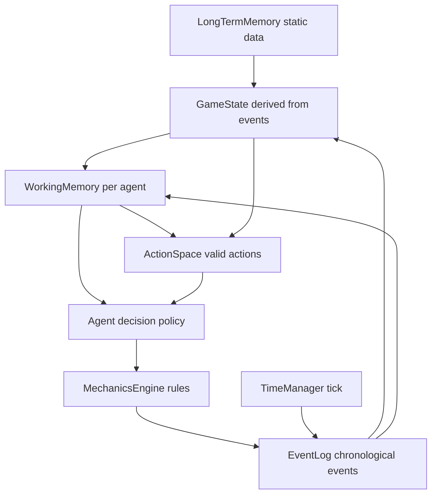
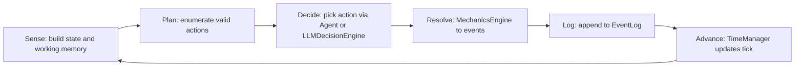

Mini-CoALA architecture plan and module interfaces are now defined for Alien in the Machine, aligned with your MVP and prior prototypes, ready for Phase 1 implementation.

Below is a concise, implementation-ready spec you can drop into [`src/routes/games/alien-in-the-machine/ARCHITECTURE_PLAN.md`](src/routes/games/alien-in-the-machine/ARCHITECTURE_PLAN.md) as the authoritative guide.

1. Design Goals (Tailored to Alien in the Machine)

- Commander-first: Player is only the Commander; all characters are autonomous agents.
- AI-first: Squads must complete missions without any commander input.
- Event-driven: Event log is the single source of truth.
- CoALA-inspired but minimal:
  - Working memory: local decision state per agent/squad.
  - Long-term memory: mission config, roles, personality, rules.
  - Structured action space: 7 core actions + 3 panic states.
  - Decision loop: repeated sense-plan-act over events.
- Modularity and testability: Each module testable with no UI, no LLM.

2. Mini-CoALA Conceptual Model

Map CoALA to a stripped-down game architecture:

- Memories
  - LongTermMemory:
    - Static data: crew roster, map, mission, mechanics config.
    - Never mutated at runtime in MVP.
  - WorkingMemory:
    - Per-agent state snapshot derived from events at a given tick.
    - Per-squad situational snapshot derived from events.
  - EpisodicMemory:
    - The EventLog itself (chronological list of events).
  - Semantic/Procedural:
    - Encoded in mechanics config and code (MechanicsEngine, AI policies).

- Action Space (internalized for this game)
  - External actions (to world):
    - MOVE, ATTACK, TAKE_COVER, INTERACT, OBSERVE, APPLY_FIRST_AID.
    - Panic: FREEZE, FLEE, FIGHT (treated as forced actions).
  - Internal actions:
    - REASON: AI/LLM selecting next action from valid options.
    - RETRIEVE: AI reading relevant events and state (via WorkingMemory).
    - LEARN (MVP-minimal): Append events; optionally store simple flags (e.g. “corridor_a is dangerous”).

- Decision Loop (per character, per tick window)
  1. Sense:
     - Build WorkingMemory from EventLog and LongTermMemory.
  2. Propose:
     - Derive valid actions from ActionSpace given mechanics and state.
  3. Decide:
     - Use CharacterAI/SquadAI (or LLM later) to pick one action.
  4. Execute:
     - MechanicsEngine resolves action into one or more events.
     - EventLog appends those events.
  5. Repeat:
     - TimeManager advances; loop continues until mission end.

3. Concrete JS Module Interfaces

Target directory: `src/routes/games/alien-in-the-machine/lib/game`

All constructs marked in clickable form as required.

3.1 Core: EventLog, GameState, TimeManager

- [`EventLog.js`](src/routes/games/alien-in-the-machine/lib/game/core/EventLog.js)
  - Responsibilities:
    - Immutable log of all events.
    - Query helpers for AI, UI, and state reconstruction.
  - Interface:
    - `EventLog.add(event)`:
      - Assigns id and tick if needed.
      - Appends to internal array.
    - `EventLog.getAll()`:
      - Returns full list (for replay/testing).
    - `EventLog.getSince(tick)`:
      - Events with event.tick > tick.
    - `EventLog.getWindow(startTick, endTick, filters?)`:
      - Basic filtering by actor, type, location.
    - `EventLog.forEntity(entityId, limit?)`:
      - Tailored retrieval for a character.
  - Event Shape (MVP, extensible):
    - `{ id, tick, type, actor?, target?, action?, panicType?, success?, damage?, details?, commander?, order?, compliance?, reason? }`

- [`TimeManager.js`](src/routes/games/alien-in-the-machine/lib/game/core/TimeManager.js)
  - Responsibilities:
    - Maintain global tick.
    - Coordinate scheduled actions if needed.
  - Interface:
    - `TimeManager.getTick()`
    - `TimeManager.advance(ticks)`
    - `TimeManager.reset()`

- [`GameState.js`](src/routes/games/alien-in-the-machine/lib/game/core/GameState.js)
  - Responsibilities:
    - Derived, read-only snapshot of world/agents at a given tick.
    - Used as WorkingMemory builder.
  - Interface:
    - `GameState.fromEvents(events, staticData)`:
      - Pure function: reconstructs state from LongTermMemory and EventLog.
    - State includes:
      - Per-character: location, health, stress, alive/incapacitated, known threats.
      - Per-room: occupants, known enemies, items.
      - Mission: objective progress, extraction status.
    - This is deterministic and testable: feed events, assert resulting state.

3.2 Mechanics: ActionSpace, MechanicsEngine

- [`ActionSpace.js`](src/routes/games/alien-in-the-machine/lib/game/mechanics/ActionSpace.js)
  - Responsibilities:
    - Enumerate and validate all 7 core actions + panic behaviors.
  - Interface:
    - `ActionSpace.getValidActions(characterId, gameState)`:
      - Returns list of candidate actions `{ type, target?, tickCost, meta }`.
    - `ActionSpace.isPanicState(stress)`:
      - Returns panic mode if thresholds reached.
    - `ActionSpace.buildPanicAction(characterId, gameState)`:
      - Returns forced FREEZE/FLEE/FIGHT if panic triggers.

- [`MechanicsEngine.js`](src/routes/games/alien-in-the-machine/lib/game/mechanics/MechanicsEngine.js)
  - Responsibilities:
    - Implement `GAME_MECHANICS_MVP.md` rules exactly.
    - Convert `(action + state)` into concrete events.
  - Interface:
    - `MechanicsEngine.resolveAction(action, state, rng)`:
      - Input:
        - `action`: from ActionSpace or AI.
        - `state`: snapshot from GameState.
        - `rng`: injectable for deterministic tests.
      - Output:
        - Array of events to append to EventLog (ACTION, PANIC, etc.).
    - `MechanicsEngine.checkSuccess(attribute, skill, difficulty)`:
      - Implements `(Attr + Skill) × 10%` ± difficulty.
    - `MechanicsEngine.applyStressRules(events, state)`:
      - Emits stress gain/loss events when triggers occur.

3.3 Memory / Agent: WorkingMemory, Agent, DecisionLoop

- [`WorkingMemory.js`](src/routes/games/alien-in-the-machine/lib/game/ai/WorkingMemory.js)
  - Responsibilities:
    - Per-agent “Mini-CoALA” working memory:
      - Local view derived from GameState and recent events.
  - Interface:
    - `buildForCharacter(characterId, gameState, eventLog, windowSize)`:
      - Returns:
        - `self`: stats, health, stress, gear.
        - `location`: room, nearby threats.
        - `squad`: known allies and their status.
        - `mission`: objective state.
        - `recentEvents`: filtered slice for that character.

- [`Agent.js`](src/routes/games/alien-in-the-machine/lib/game/ai/Agent.js)
  - Responsibilities:
    - Represents a single autonomous character; implements propose/decide step.
  - Interface:
    - `Agent.constructor(characterConfig, personality)`
    - `Agent.decideAction(workingMemory, availableActions)`:
      - Returns a single chosen action from ActionSpace.
      - Uses:
        - Priority rules from PROJECT_PLAN/MVP (self-preservation, mission, squad, exploration).
        - Personality and agendas to break ties.

- [`DecisionLoop.js`](src/routes/games/alien-in-the-machine/lib/game/ai/DecisionLoop.js)
  - Responsibilities:
    - Orchestrate the CoALA-style loop each tick for all agents.
  - Interface:
    - `DecisionLoop.step({ eventLog, staticData, rng })`:
      - 1. Compute current `state = GameState.fromEvents`.
      - 2. For each active character:
        - Build `wm = WorkingMemory.buildForCharacter`.
        - Compute `valid = ActionSpace.getValidActions`.
        - If panic: use `ActionSpace.buildPanicAction`.
        - Ask `agent.decideAction(wm, valid)`.
        - Pass chosen action to `MechanicsEngine.resolveAction`.
      - 3. Collect all events, apply to EventLog (respecting tick costs via TimeManager).

Note: SquadAI (for group coordination) can wrap multiple Agents later; it is not required for the minimal Mini-CoALA.

3.4 LLM Integration (later phases, but shaped now)

To align with CoALA without bloating MVP:

- [`LLMContextBuilder.js`](src/routes/games/alien-in-the-machine/lib/game/ai/LLMContextBuilder.js)
  - Built directly on EventLog + WorkingMemory.
  - Mirrors the structured context defined in MEMORY_BANK.

- [`LLMDecisionEngine.js`](src/routes/games/alien-in-the-machine/lib/game/ai/LLMDecisionEngine.js)
  - Optional alternative implementation of `decideAction`.

These are explicitly Phase 3+ and must not be required for the core loop.

4. Mapping to PROJECT_PLAN.md Phases

- Phase 1: Core Event System
  - Implement: EventLog, GameState, MechanicsEngine (core rules), TimeManager, ActionSpace.
  - Test:
    - Deterministic resolution of actions.
    - Replay correctness from EventLog.

- Phase 2: Autonomous AI Squad
  - Implement: WorkingMemory, Agent, DecisionLoop (and simple SquadAI if desired).
  - Test:
    - No commander, no LLM.
    - Given mission/map/crew, squads can attempt and sometimes complete mission.
    - Behavior reflects stress/panic and priorities.

This matches your existing v3.1 documents, but is trimmed and focused as a Mini-CoALA: minimal modules, explicit memory/action/decision abstractions, and no ECS tangle.

5. Mermaid Diagrams (Mini-CoALA Overview)

These avoid problematic characters inside brackets.

- Data Flow:

- Decision Cycle (per step):

6. How This Serves Your Goals

- This is a direct, minimal CoALA adaptation:
  - Explicit memories (EventLog, GameState, WorkingMemory, static data).
  - Structured action space (MVP actions as the only allowed outputs).
  - Clear decision loop (Sense → Plan → Decide → Act → Learn via events).
- It:
  - Keeps systems small and testable.
  - Reuses patterns already proven in `Rules/alien-proto/v3.1`.
  - Avoids the v2 pitfalls (UI-first, ad-hoc actions, ECS sprawl).
  - Creates a portable template you can apply to other portfolio games.